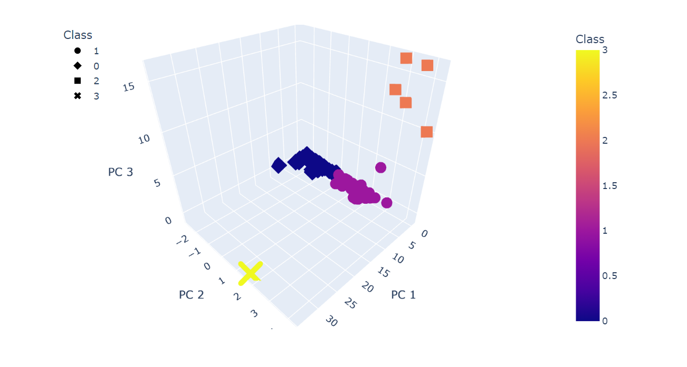

# Cryptocurrencies

### Unsupervised Machine Learning and Cryptocurrencies

## Overview

This project implements unsupervised machine learning to create an analysis for prospective clients preparing to dive into the cryptocurrency market. The client, a prominent investment bank, is interested in offering a new cryptocurrency investment portfolo for its customers. To provide clarification on the crypto universe to our client, we must create a report that includes the current cryptocurrencies on the trading market and how these currencies can be grouped together to create a classification system for the new investment portfolio.

To accomplish this analysis, we must first preprocess the targeted dataset which can then be fit into a clustering algorithm (K-means). Once we run our unsupervised machine learning models, data visualizations can be generated to share our findings.

## Purpose

The purpose of this project was to analyze a dataset from many alternative cryptocurrencies to spot trends that make a firm or person want to invest in them. The problem with cryptos is that the most common ones, like bitcoin or ethereum, are becoming unaffordable for the common public. That being said, I will be using unsupervised machine learning to see if we can spot any trends that result in opportunities of these altcoins.

A client asked for a list of tradable cryptocurrencies and wants to be able to pick them from a classification system.

- Describe the differences between supervised and unsupervised learning, including real-world examples of each.
- Preprocess data for unsupervised learning.
- Cluster data using the K-means algorithm.
- Determine the best number of centroids for K-means using the elbow curve.
- Use PCA to limit features and speed up the model.

## Results

